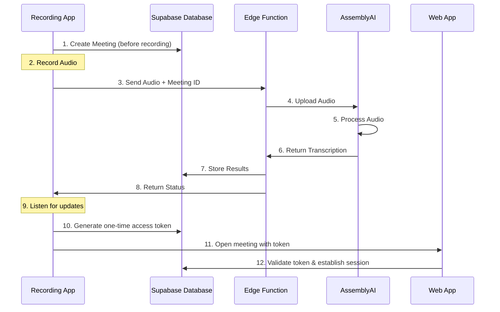

# Recording App Integration Guide

This guide explains how to integrate an external recording application with the Mishi meeting transcription system using direct Supabase integration.

## Overview

The integration allows an external recording app to:
1. Record audio
2. Create a meeting in Mishi
3. Send audio for transcription
4. Get back meeting details and transcription results
5. Open the meeting in the Mishi web app

## Flow

1. Create a meeting first
2. Record audio
3. Send audio for transcription with the meeting ID
4. Get transcription results and updates
5. Open meeting in web app when complete
   - Generate a secure one-time access token
   - Redirect to web app with token
   - Web app validates token and establishes user session

## Architecture



## Integration Implementation

```typescript
import { createClient } from '@supabase/supabase-js'

interface MishiIntegrationConfig {
  supabaseUrl: string;
  supabaseKey: string;  // Use service role key
  workspaceId: string;
  webAppUrl: string;    // Base URL of the Mishi web app
}

class MishiDirectIntegration {
  private supabase;
  private workspaceId: string;
  private currentMeetingId: string | null = null;
  private webAppUrl: string;

  constructor(config: MishiIntegrationConfig) {
    this.supabase = createClient(config.supabaseUrl, config.supabaseKey);
    this.workspaceId = config.workspaceId;
    this.webAppUrl = config.webAppUrl;
  }

  async startRecordingSession(title: string) {
    // Create meeting first
    const { data: meeting, error } = await this.supabase
      .from('meetings')
      .insert({
        title,
        workspace_id: this.workspaceId,
        created_at: new Date().toISOString(),
        transcription_status: 'awaiting_recording' // Initial status
      })
      .select()
      .single();

    if (error) throw error;
    this.currentMeetingId = meeting.id;
    return meeting;
  }

  async transcribeAudio(audioBlob: Blob) {
    if (!this.currentMeetingId) {
      throw new Error('No active meeting. Call startRecordingSession first.');
    }

    const base64Audio = await this.blobToBase64(audioBlob);
    
    // Update meeting status
    await this.supabase
      .from('meetings')
      .update({ transcription_status: 'processing' })
      .eq('id', this.currentMeetingId);
    
    const { data: transcription, error } = await this.supabase
      .functions.invoke('transcribe-audio', {
        body: {
          audioData: base64Audio,
          meetingId: this.currentMeetingId,
          languageCode: 'en_us',
          features: ['sentiment_analysis', 'auto_highlights', 'iab_categories']
        }
      });

    if (error) throw error;
    return transcription;
  }

  // Updated method to handle authentication
  async openInWebApp(userId: string) {
    if (!this.currentMeetingId) {
      throw new Error('No active meeting.');
    }

    // Generate a one-time access token
    const { data: token, error: tokenError } = await this.supabase
      .rpc('generate_meeting_access_token', {
        p_meeting_id: this.currentMeetingId,
        p_user_id: userId
      });

    if (tokenError) throw tokenError;

    // Construct URL with token
    const url = `${this.webAppUrl}/meeting/${this.currentMeetingId}?access_token=${token}`;
    
    if (typeof window !== 'undefined') {
      window.open(url, '_blank');
    }
    return url;
  }

  // Optional: Subscribe to transcription status updates
  subscribeToTranscriptionStatus(callback: (status: string) => void) {
    if (!this.currentMeetingId) {
      throw new Error('No active meeting to subscribe to.');
    }

    return this.supabase
      .channel(`meeting-${this.currentMeetingId}`)
      .on(
        'postgres_changes',
        {
          event: 'UPDATE',
          schema: 'public',
          table: 'meetings',
          filter: `id=eq.${this.currentMeetingId}`
        },
        (payload) => callback(payload.new.transcription_status)
      )
      .subscribe();
  }

  private async blobToBase64(blob: Blob): Promise<string> {
    return new Promise((resolve, reject) => {
      const reader = new FileReader();
      reader.onload = () => {
        if (typeof reader.result === 'string') {
          resolve(reader.result);
        } else {
          reject(new Error('Failed to convert blob to base64'));
        }
      };
      reader.onerror = () => reject(reader.error);
      reader.readAsDataURL(blob);
    });
  }
}
```

## Usage Example

```typescript
// Updated usage example with authentication
mishiIntegration.subscribeToTranscriptionStatus((status) => {
  console.log('Transcription status:', status);
  // When transcription is complete, open in web app with user authentication
  if (status === 'completed') {
    const userId = 'current-user-id'; // Get this from your auth system
    const meetingUrl = await mishiIntegration.openInWebApp(userId);
    console.log('Meeting ready at:', meetingUrl);
  }
});

// Start recording
const mediaRecorder = new MediaRecorder(stream);
const audioChunks: Blob[] = [];

mediaRecorder.ondataavailable = (event) => {
  audioChunks.push(event.data);
};

mediaRecorder.onstop = async () => {
  const audioBlob = new Blob(audioChunks, { type: 'audio/webm' });
  
  try {
    // Send for transcription
    const transcription = await mishiIntegration.transcribeAudio(audioBlob);
    console.log('Transcription complete:', transcription);
  } catch (error) {
    console.error('Failed to process recording:', error);
  }
};

// Start recording
mediaRecorder.start();
```

## Database Schema

```sql
-- Meetings table schema
create table public.meetings (
  id uuid default gen_random_uuid() primary key,
  title text not null,
  workspace_id uuid references workspaces(id),
  company_id uuid references companies(id),
  created_by uuid references auth.users(id),
  created_at timestamp with time zone default timezone('utc'::text, now()),
  updated_at timestamp with time zone default timezone('utc'::text, now()),
  notes text,
  transcription jsonb,
  sentiment_analysis jsonb,
  key_phrases jsonb,
  topics jsonb,
  llm_prompt text,
  llm_input text,
  llm_response text
);

-- RLS Policies
alter table public.meetings enable row level security;

-- Allow users to view meetings in their workspace or for their workspace companies
create policy "Users can access meetings for their workspace companies"
  on public.meetings for select
  using (
    workspace_id in (
      select workspace_id from workspace_members
      where user_id = auth.uid()
    ) or 
    company_id in (
      select id from companies 
      where workspace_id in (
        select workspace_id from workspace_members
        where user_id = auth.uid()
      )
    )
  );

-- Allow users to create meetings in their workspace
create policy "Users can create meetings in their workspace"
  on public.meetings for insert
  with check (
    workspace_id in (
      select workspace_id from workspace_members
      where user_id = auth.uid()
    )
  );

-- Allow users to update their own meetings
create policy "Users can update meetings they created"
  on public.meetings for update
  using (created_by = auth.uid())
  with check (created_by = auth.uid());

-- Allow users to delete their own meetings
create policy "Users can delete meetings they created"
  on public.meetings for delete
  using (created_by = auth.uid());
```

## Implementation Notes

### Audio Format Support
- Supported formats: WAV, MP3, WebM
- Maximum file size: Check your AssemblyAI plan limits
- Recommended sample rate: 16kHz or higher
- Recommended bit depth: 16-bit

### Security Requirements

1. **Service Role Key**
   - Store securely in environment variables
   - Never expose in client-side code
   - Use only in secure server environments

2. **Meeting Access Tokens**
   - One-time use only
   - Short expiration time (e.g., 5 minutes)
   - Tied to specific meeting and user
   - Invalidated after use

3. **RLS Policies**
   - Ensure workspace-based access control
   - Test policies thoroughly
   - Consider using application roles

### Error Handling

Implement proper error handling for:
1. Network failures
2. Authentication errors
3. File size/format issues
4. Transcription failures

Example:
```typescript
try {
  const meeting = await mishiIntegration.createMeeting('Important Meeting');
  const transcription = await mishiIntegration.transcribeAudio(audioBlob, meeting.id);
} catch (error) {
  if (error.message.includes('permission denied')) {
    // Handle permission errors
    console.error('Permission denied:', error);
  } else if (error.message.includes('file size')) {
    // Handle file size errors
    console.error('File too large:', error);
  } else {
    // Handle other errors
    console.error('Unexpected error:', error);
  }
}
```

### Performance Considerations

1. **Audio Processing**
   - Compress audio when possible
   - Use appropriate formats (WebM preferred)
   - Consider chunking large files

2. **Real-time Updates**
   - Use Supabase realtime for status updates
   - Handle connection drops gracefully
   - Implement reconnection logic

### Transcription Status States
- `awaiting_recording`: Initial state when meeting is created
- `processing`: Audio is being processed by AssemblyAI
- `completed`: Transcription is finished and available
- `error`: Processing failed (includes error details)
- `cancelled`: Processing was cancelled

### Edge Function: transcribe-audio

Request Parameters:
```typescript
interface TranscribeAudioRequest {
  audioData: string;        // Base64 encoded audio data
  meetingId: string;        // UUID of the meeting
  languageCode: string;     // e.g., 'en_us', 'es_es'
  features: string[];       // ['sentiment_analysis', 'auto_highlights', 'iab_categories']
}
```

Response Format:
```typescript
interface TranscribeAudioResponse {
  success: boolean;
  data?: {
    transcription: {
      text: string;
      segments: Array<{
        text: string;
        start: number;
        end: number;
        confidence: number;
      }>;
    };
    sentiment_analysis?: {
      overall_sentiment: 'positive' | 'negative' | 'neutral';
      segments: Array<{
        text: string;
        sentiment: string;
        confidence: number;
      }>;
    };
  };
  error?: {
    code: string;
    message: string;
    details?: any;
  };
}
```

Rate Limits:
- Maximum audio file size: 100MB
- Maximum audio duration: 4 hours
- Concurrent transcriptions per workspace: 5
- API calls per minute: 60

### Token Authentication

Token Format:
- 32-byte random hex string
- Example: `a5c6a2cf88ac0588a198521df4a7813cac4f11b44d85417171d8a9e1cb6176bd`

Error Responses:
```typescript
interface TokenError {
  error: {
    message: string;    // Error description
    code: string;       // Error code
  };
}

// Error Codes
const TOKEN_ERRORS = {
  INVALID_TOKEN: 'token/invalid',        // Token doesn't exist
  EXPIRED_TOKEN: 'token/expired',        // Token has expired
  USED_TOKEN: 'token/already-used',      // Token was already used
  USER_MISMATCH: 'token/user-mismatch',  // Token belongs to different user
  MISSING_TOKEN: 'token/missing'         // No token provided
};
```

### Realtime Subscriptions

Configuration:
```typescript
const REALTIME_CONFIG = {
  timeout: 10000,           // Reconnection timeout (ms)
  retryInterval: 1000,      // Time between retries (ms)
  maxRetries: 5,           // Maximum retry attempts
  retryBackoff: true       // Enable exponential backoff
};
```

Error Handling:
```typescript
subscribeToTranscriptionStatus(callback: (status: string) => void) {
  if (!this.currentMeetingId) {
    throw new Error('No active meeting to subscribe to.');
  }

  let retryCount = 0;
  
  const channel = this.supabase
    .channel(`meeting-${this.currentMeetingId}`)
    .on(
      'postgres_changes',
      {
        event: 'UPDATE',
        schema: 'public',
        table: 'meetings',
        filter: `id=eq.${this.currentMeetingId}`
      },
      (payload) => callback(payload.new.transcription_status)
    )
    .on('error', (error) => {
      console.error('Subscription error:', error);
      if (retryCount < REALTIME_CONFIG.maxRetries) {
        retryCount++;
        setTimeout(() => {
          channel.subscribe();
        }, REALTIME_CONFIG.retryInterval * retryCount);
      }
    })
    .subscribe();

  return channel;
}
```

## Support

For issues or questions:
1. Check error logs in Supabase dashboard
2. Review edge function logs
3. Contact support with:
   - Error messages
   - Audio file details
   - Database logs 